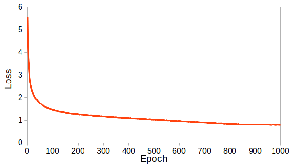
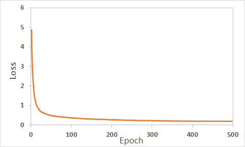

# SimCLR Tensorflow
This is an implementation of SimCLR for Tensorflow 2 for processing on a single GPU. This implementation focuses on ResNet-18 and ResNet-34 and provides a simple workflow for fine-tuning for classification or segmentation. We demonstrate example results for cifar-10 and the UTKFace datset. The official repository can be found [here](https://github.com/google-research/simclr)

## SimCLR
Simple contrastive learning of visual representations is a framework for self-supervised learning of image representations. For an overview of how SimCLR works I suggest this excellent [post](https://amitness.com/2020/03/illustrated-simclr/) or the [paper](https://arxiv.org/abs/2002.05709). Briefly, SimCLR applies 2 different augmentations to the same image which are then fed (along with similarly augmented image pairs in a batch) through a convolutional neural network which outputs a representation *h* of these images. This is then fed into a projection head *g(h)* which outputs a latent representation *z* of these images. The similarity of each image representation *z* is then computed using the cosine similarity. The loss function of SimCLR attempts to maximize the agreement between the latent representations of different augmentations of the same image. 

## Implementation
This implementation focuses on single GPU usage and offers ResNet-18 and ResNet-34 architectures. The following data augmentations are implemented - *crop and resize, color jitter, color drop, gaussian noise, flipping, rotations, cutout*. This implementation further provides functions for fine-tuning for both classification and segmentation.

## Usage
### Pre-training
Pre-training of the network requires providing the input image size, the path to a text file **train_file_path** where each line in the text file corresponds to the path of a training image. For pretraining the task argument must be set to **pretrain**. Other optional arguments include batch size, crop size, number of training epochs. See example below and config.py for a full list of configurations.

```
python main.py --input_size="240 240" --crop_size="80 80" --train_file_path=/home/path/to/file.txt --task=pretrain --batch_size=256 --num_epochs=1000
```

Data augmentation can be turned on or off by including them in the arguments. For example to train a model without color jitter or image flipping the below arguments can be used. Crop and resize, color jitter, color drop, gaussian noise, flipping are turned on by default.

```
python main.py --input_size="240 240" --crop_size="80 80" --train_file_path=/home/path/to/file.txt --task=pretrain --batch_size=256 --num_epochs=1000 --no-flip --no-jitter
```

### Fine-tuning
Fine-tuning of the network can be done for image classification or image segmentation. When fine-tuining from the command line we need to enter the argument for the task which will be either **classification** or **segmentation**. Further the number of classes should be entered. Each line in **train_file_path** should include the path to the input image followed by a comma and either for 1. Classification: the image class as an integer or 2. Segmentation: the path to a labelmap file where each pixel in the labelmap corresponds to a different pixel class.

```
python main.py --input_size="240 240" --train_file_path=/home/path/to/file.txt --task=segmentation --num_classes=5
```

The default method for classification is to use a linear projection. A non-linearity can also be included. The base model weights can be frozen by setting the argument freeze=True. See example below for fine-tuning with a frozen base model.
```
python main.py --input_size="240 240" --train_file_path=/home/path/to/file.txt --task=classification --num_classes=5 --freeze
```

A validation dataset can be evaluated while finetuning by passing a file path to the argument **val_file_path**. This should be formatted similarly to **train_file_path**. For example
```
python main.py --input_size="240 240" --train_file_path=/home/path/to/file.txt --val_file_path=/home/path/to/file.txt --task=classification --num_classes=5 --freeze
```

## Example Results
### Cifar-10
This example uses the cifar10 dataset and attempts to replicate the results from the paper on a single GPU. Cifar-10 is a dataset of 60,000 32x32 color images of 10 classes split into 50,000 training images and 10,000 test images.

#### Pretraining
To pretrain the cifar10 dataset we set the cifar10 argument to True. We pretrain the model for up to 1,000 epochs and the loss is shown below. Pretraining is done on the training dataset and we use a batch size of 256. We use a linear warmup for 1,000 iterations then decay the learning rate with cosine decay.



#### Linear evaluation
For the linear evaluation we discard the projection head, freeze the model weights and train a linear classifier for 10 epochs. The results are shown in the table below where the linear evaluation is performed at different training checkpoints.


| Pretrain Epoch  |  200  |  400  |  600  |  800  | 1000  |
| --------------  |:-----:|:-----:|:-----:|:-----:|:-----:|
| Test Accuracy   |  85.4 |  88.3 |  89.5 |  89.5 |  89.9 |

The above results can be replicated by first pretraining and then finetuning as below. 

```
python main.py --task=pretrain --cifar10=True --batch_size=256 --num_epochs=1000 --temperature=0.1 --strength=0.5 --learning_rate=1.0
python main.py --task=classification --cifar10=True --batch_size=256 --num_classes=10 --pretrain_save_path=logs/pretrain --finetune_save_path=logs/finetune --freeze
```

### UTKFace
This example case uses the [UTKFace dataset](https://susanqq.github.io/UTKFace/). This dataset consists of over 20,000 face images where each face is labelled with age, gender and ethnicity. This example is contained within this [colab](https://colab.research.google.com/drive/1DGs85UUTGFEYHTeud9kM-fpwOKNXXdHt?usp=sharing)

#### Pretraining
We pretrain the model for 500 epochs and the loss is shown below. We use a linear warmup for 1000 iterations then decay the learning rate.



#### Linear evaluation 
For the linear evaluation we discard the projection head, freeze the model weights and train a linear classifier. We train the linear classifier on 80% of the training data and evaluate it on the remaining 20%. The results are shown in the table below.

| Training Epoch  |  100  |  200  |  300  |  400  |  500  |
| --------------  |:-----:|:-----:|:-----:|:-----:|:-----:|
| Accuracy        |   45  |   55  |   44  |   66  |   44  |

#### T-SNE visualization
The SimCLR paper showed that the last layer of the ResNet model *h*, visually separated dataset classes better than the output *z* of the projection head *g(h)*. Here we also compare the separation for both layers.


.png)


